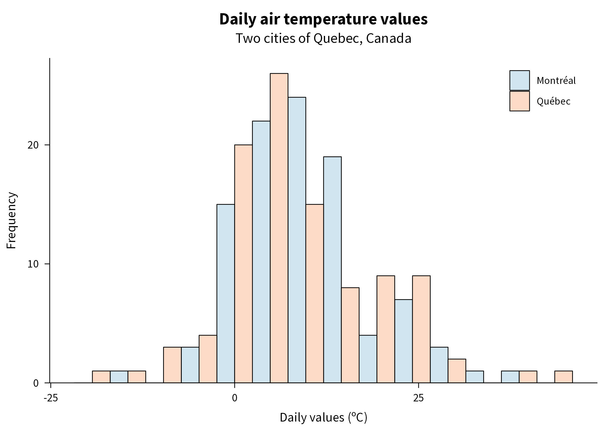
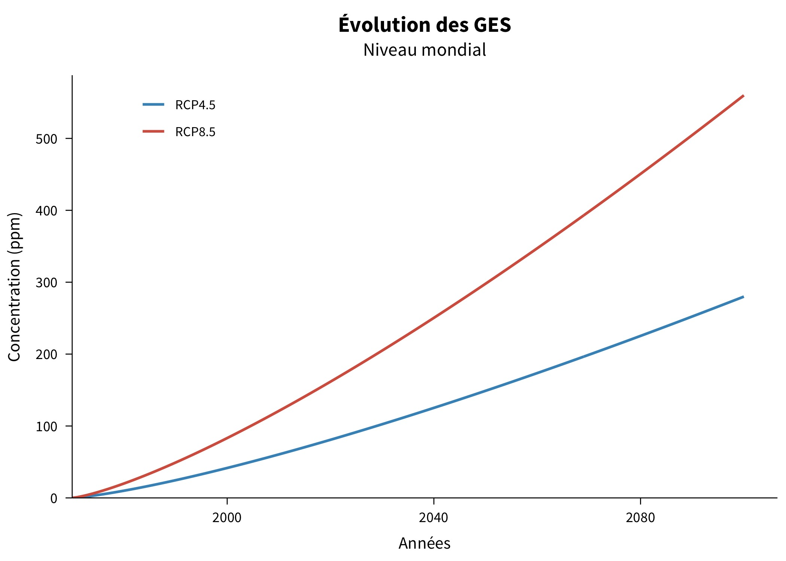
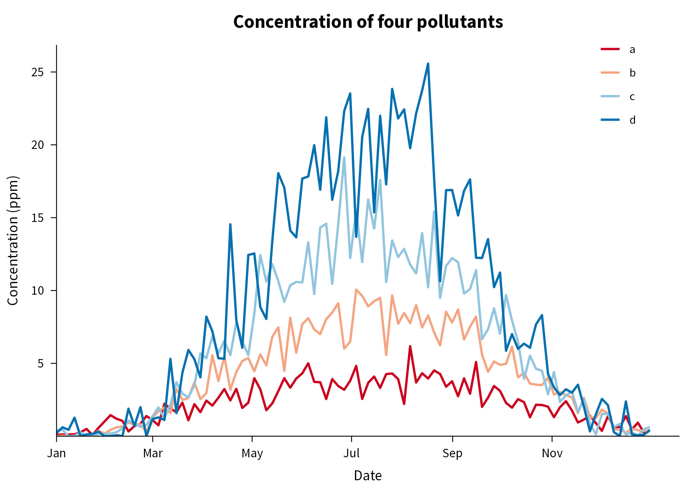
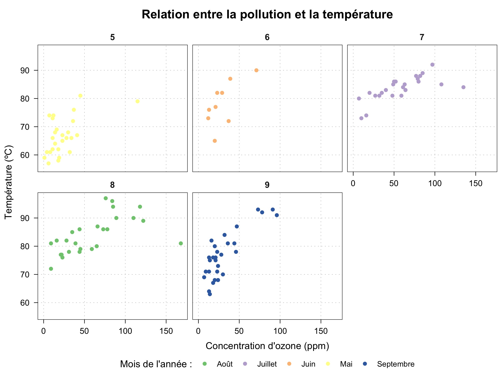

***jtheme*** : a custom `ggplot2` theme
================================================================================

Welcome to `jtheme`, a custom theme for ggplot2, adaped for scientif content such as papers, presentations and more. Here are some examples of the `jtheme` in action !

***Note** : All illustrations are from fake data.*

## Histograms

## Lines

## Time series

## Scatter plot

## Facets

