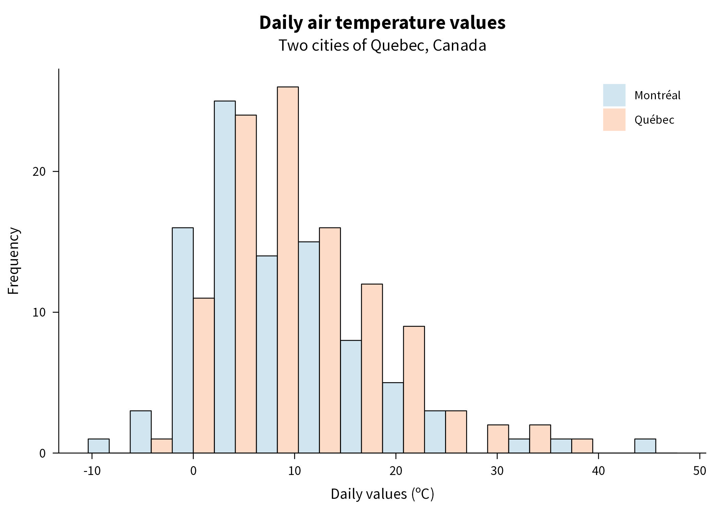
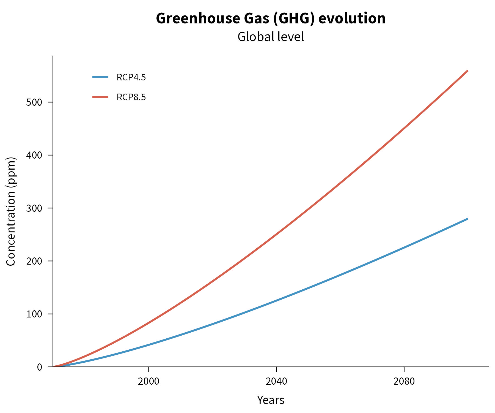
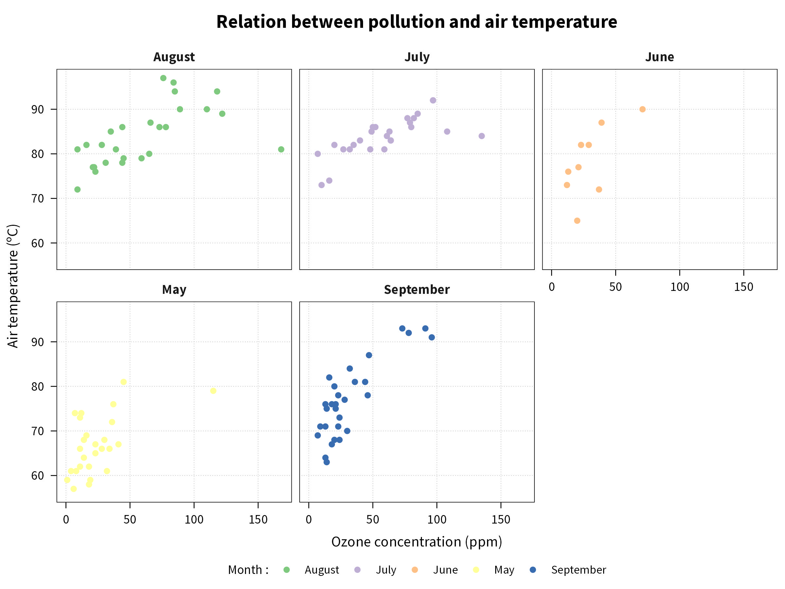

***jtheme*** : a custom `ggplot2` theme
================================================================================


Welcome to `jtheme`, a custom theme for ggplot2, adapted for scientific content such as papers, presentations and more. 

Installation
--------------------------------------------------------------------------------

`jtheme` use the Source Sans Pro, which is an [open source font](https://fonts.google.com/specimen/Source+Sans+Pro#standard-styles) from Google. It needs to be installed on your system and in R. It is located in the `fonts/` folder of the package. You will need the packages `extrafont` and `Rttf2pt1` in order to get the Source Sans Pro into R properly before you can use `jtheme`.

1. Install `ggplot2` and `extrafont` packages :

```r
install.packages("ggplot2")
install.packages("extrafont")
```

2. Install `Rttf2` using the `remotes` package :

```r
install.packages("remotes")
library(remotes)
remotes::install_version("Rttf2pt1", version = "1.3.8")
```

3. Import the Source Sans Pro font into R : 

```r
extrafont::font_import(path = "_fonts/")
```

4. You can now install `jtheme` directly from GitHub :

```r
install.packages(
    pkgs  = "https://github.com/jeremieboudreault/jtheme/raw/main/bin/jtheme_0.0.2.tar.gz", 
    repos = NULL
)
```

5. You can start using `jtheme` by simply adding it to your `ggplot2` plots :

```r
library(jtheme)
ggplot() + ... + jtheme()
```

***Enjoy !***


Examples
--------------------------------------------------------------------------------

***Note** : All illustrations are from fake data.*

### 1. Histogram of temperature data

```r
+ jtheme(
    expand_xy      = "x_only",   # Remove expanding of y-axis
    legend_pos     = "topright", # Legend at the top-right
    show_leg_title = FALSE       # Hide legend title
)
```



### 2. GHG evolution

```r
+ jtheme(
    expand_xy      = FALSE,      # No expansion of x and y axes
    legend_pos     = "topleft",  # Legend at top-left
    show_leg_title = FALSE       # No legend title
)
```



### 3. Times series of air pollution

```r
+ jtheme(
    expand_xy        = FALSE,      # No expansion of x and y axes
    legend_pos       = "topleft",  # Legend at top-left
    show_leg_title   = FALSE       # No legend title
    x_labs_to_months = TRUE        # Convert x-labels to months
)
```


### 4. Scatter plot of air pollution and temperature

```r
+ jtheme(
    show_grid = TRUE  # Add a grid in the plot
)
```


### 5. Scatter plot of air pollution and temperature by facets

```r
+ jtheme(
    show_grid = TRUE,  # Add a grid in the plot
    borders   = "all"  # Add complete borders
)
```


